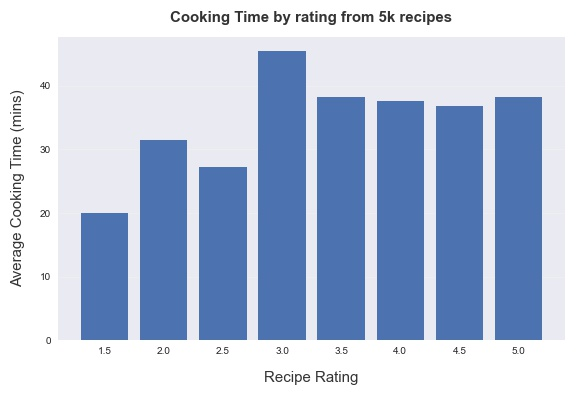
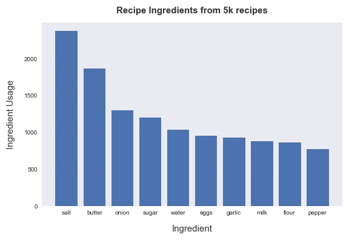

<!-- 

 -->

    <h1> 🍱 Recipe Generator 🍱 </h1>

 

---

## Problem Statement

Problem 1: It can be difficult to find quick tasty recipes.

Problem 2: One often has limited ingredients to cook from.

Problem 3: Mixing different cuisines can be very difficult

--- 

## Overview

This project aims to address the three problem statements by creating an all in one website which allows users to do the following:

    1) Search over recipes that are proven to have good ratings and are quick to make.

    2) Create recipes based on the ingredients a user has.

    3) Allow users to pick two cuisines and mix them together to create new fusion recipes.

**Solution to problem 1:**
* Recipes with user ratings of four star or more and a cooking time under two hours is kept in the database. Users can then find these recipes by searching ingredients.

**Solution to problem 2:**
* Users can enter which ingredients they have left and a recipe name is created, along with instructions on how to create this recipe. This was done by using the [Chef Transformer](https://huggingface.co/flax-community/t5-recipe-generation) API which was built using 5 NLP engineers.

**Solution to problem 3:**
* Users pick two different cuisines (African, Indian, Chinese, Thai, Japanese) and one ingredient and a new fusion recipe is created. 

* The model works by picking one random recipe from the users first cuisine pick e.g. random African recipe with the ingredient of the users choice and matches it with the best matched recipe of the users second cuisine pick e.g. an Indian chicken recipe.

* The best matched cuisine is picked by comparing the ingredient lists of the users randomly picked cuisine recipe and all the recipes of the users second picked cuisines. The match is done using sentiment analysis from the Spacy library. Spacy is able to indentify ingredients such as Garlic and Ginger being similar and thus have a high score (0.733), compared to ingredients such as Garlic and Milk which would score relatively low (0.528). This method allows relatively similar recipes to be combined e.g. a desert would not be combined with a curry as most of the ingredients are not very similar.

* Any duplicate ingredients are removed and a new fusion recipe is outputed to the user.

---

## Data Analysis
#### More Thyme Cooking --> More Taste

#### Pantry and Fridge Essentials

---

## Future Developments
* Categorise ingredients into core components, split foods into carbs, proteins, veg and different spices. This would allow for recipes to be created with nice balance to them. For example, you would only be given one carb, one protein, two veg and a selection of spiciers.

* Cluster recipes by  ingredients, to find out what are some common ingredient combinations.

* Optimize run time. As the application you saw on streammlit is only running a model from a small dataset, when this gets increased to 500 thousand recipes it can take some time.  

---

## Data sources
The datset contained over 500,000 recipes with nearly 1.5 million reviews from 271,000 users. The recipes contain information from cooking time to nutrional information, although only a small amount of this information was used (see 'Data Dictionary' below).

[Original Recipes Dataset](https://www.kaggle.com/shuyangli94/food-com-recipes-and-user-interactions?select=RAW_recipes.csv)

#### Data dictionary 
*The final dataset uses the following data dictionary:*

| Feature        	    | Type   	| Description                                                                                                      	|
|-------------------	|--------	|------------------------------------------------------------------------------------------------------------	|
| RecipeIngredientParts | object  	| All the ingredients for the recipe                                                                      	|
| RecipeCategory   	| object 	| The type of cuisine/category the recipe is e.g. Indian                                  	|
| Name     	| object 	| The name of the recipe
| CookTime   	| float  	| The time it takes to cook the recipe    